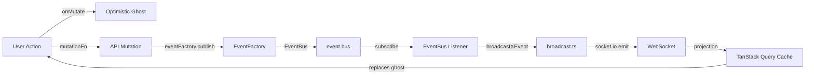
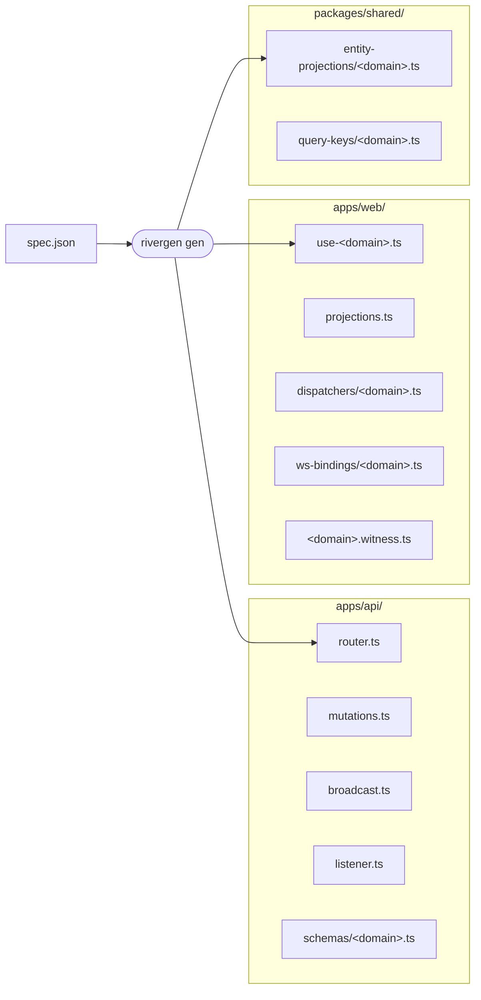

# RiverGen

[](https://www.npmjs.com/package/@rivergen/cli)
[](LICENSE)
[](CONTRIBUTING.md)

**Verifiable realtime architecture for collaborative applications.**

---

Realtime systems fail quietly.

Your mutation succeeds. Your WebSocket event fires. Your cache updates. But somewhere between the mutation, the event envelope, the listener, the broadcast, the dispatcher, and the projection — the data drifts.

A field disappears. A ghost card never reconciles. A private entity leaks into the wrong room. The UI slowly stops matching reality — and you usually won't know until a user reports it.

As realtime apps grow, they accumulate competing data paths. An `onSuccess` cache write here. A manual `invalidateQueries` there. A projection that handles most events but not all. Eventually nobody knows which path is authoritative. The realtime layer becomes something only one engineer fully understands. Every fix risks introducing another silent failure.

**The core problem is not complexity — it is the absence of accountability.**

---

## What RiverGen is

An open-source scaffold and enforcement framework for realtime architectures that need to stay understandable as they scale.

You keep your own backend. Your own database. Your own transport. RiverGen enforces the architecture around them.

**Three layers:**

- **Scaffold** — one spec generates 12 files: router, mutations, broadcast, listener, hooks, projections, schema slice, dispatcher slice, ws-bindings slice, entity-projection slice, query-keys slice, and a witness stub. The architecture exists before you write a line of business logic.
- **Gate** — 12 structural checks run on `rivergen verify`. Drift from the One River path becomes a build error, not a production incident.
- **Witness** — field-level continuity proof. Every field tracked from the event payload through the broadcast, the projection, and into the TanStack Query cache. Structural correctness is necessary — Witness proves the data survived the pipeline.

---

## One River

The core idea: **one verified path from mutation to cache.**

```
mutation
  → EventFactory.publish()
    → EventBus listener
      → broadcast helper
        → WebSocket
          → dispatcher
            → projection
              → TanStack Query cache ✓
```



When there is one path, accountability is possible. When there are two — an `onSuccess` write here, a `setQueryData` patch there — accountability disappears.

> **The gates prove the pipeline exists. Witness proves the data survived it.**

---

## Workflow

```bash
rivergen init                   # once per project — writes infrastructure layer
rivergen plan specs/task.json   # dry-run: inspect what will be generated
rivergen gen specs/task.json    # write 12 domain files + regenerate barrels
# fill in: mutations → schema → listener → hook → projections → witness
rivergen verify                 # run all 12 gates
```

One spec. One command. Twelve files, all wired:



See [docs/guides/first-domain.md](https://github.com/Mithun-Chandar/rivergen/blob/main/docs/guides/first-domain.md) for a complete step-by-step walkthrough.

---

## Try it

> **Demo app coming soon.** Clone-and-run example with ghost reconciliation, room-scoped updates, and a complete passing `rivergen verify` transcript.

---

## Gates

12 structural checks run on every `rivergen verify`.

| Gate                              | What it enforces                                                                       |
| --------------------------------- | -------------------------------------------------------------------------------------- |
| **#1** Mutation → EventFactory    | Mutations publish through EventFactory — no direct socket or eventBus bypass           |
| **#2** Listener → broadcast chain | The full subscribe → broadcast → emit path is wired                                    |
| **#3** Dispatcher → projection    | Every WS event routes through a dispatcher to a projection function                    |
| **#4** Projection → entity-cache  | Projections use entity-cache helpers — no raw `setQueryData`                           |
| **#5** Room scoping               | Private entities are scoped to rooms, not broadcast globally                           |
| **#6** Schema coverage            | Every emitted event has a registered Zod schema                                        |
| **#7** Schema `.strict()`         | Every schema uses `.strict()` — prevents silent field stripping at publish time        |
| **#8** Provider isolation         | `WebSocketProvider` does not import entity-cache or call projections directly          |
| **#9** No `onSuccess` writes      | Cache convergence belongs to projections only                                          |
| **#10** Optimistic coverage       | Every mutation has `onMutate` + `onError`                                              |
| **#11** Event audit coverage      | Every event is covered in payload continuity audit artifacts (skipped if none present) |
| **#12** Witness coverage          | Every broadcast event has a complete witness entry                                     |

See [docs/reference/gates.md](https://github.com/Mithun-Chandar/rivergen/blob/main/docs/reference/gates.md) for the full gate reference. See [docs/examples/failure-lab.md](https://github.com/Mithun-Chandar/rivergen/blob/main/docs/examples/failure-lab.md) for real `rivergen verify` output for each violation — broken code, exact error, and fix.

---

## Witness

Gates verify that the realtime pipeline is structurally wired. Witness verifies that the data actually survived it — every field, every hop.

`rivergen gen` scaffolds a `*.witness.ts` file for each domain. You fill in `requiredFields`, `testPayloads`, and a `lifecycle()` function that seeds a QueryClient, applies the projection, and asserts that fields land correctly in cache. Gate #12 runs four layers of checks — static schema contract, broadcast contract, dynamic projection proof, and coverage completeness.

See [docs/concepts/witness-layers.md](https://github.com/Mithun-Chandar/rivergen/blob/main/docs/concepts/witness-layers.md) for how the four layers work, and [docs/guides/write-a-witness.md](https://github.com/Mithun-Chandar/rivergen/blob/main/docs/guides/write-a-witness.md) for a step-by-step fill-in guide.

---

## Getting started

**Requirements:** Node.js ≥ 18, TypeScript, Express + socket.io on the backend, React + TanStack Query on the frontend.

```bash
npm install -g @rivergen/cli
rivergen init
```

`@rivergen/witness` is installed automatically by `rivergen gen --install`, or manually:

```bash
pnpm add -D @rivergen/witness --filter ./apps/web
```

---

## Stack

| Layer             | Required          |
| ----------------- | ----------------- |
| API runtime       | Node.js ≥ 18      |
| API framework     | Express 5         |
| WebSocket         | socket.io 4       |
| Schema validation | Zod ≥ 3           |
| Web framework     | React             |
| Server state      | TanStack Query v5 |
| Language          | TypeScript ≥ 5    |

---

## Why this exists

RiverGen came out of building [Sodium](https://github.com/Mithun-Chandar/sodiumv2), a collaborative workspace product. In v1, realtime worked — until it didn't.

Ghost cards that wouldn't go away. Stale data that only corrected on navigation. Fields the backend sent that the frontend never rendered. Each fix added another competing data path. The architecture became something only one person on the team fully understood. Nobody wanted to add new realtime domains.

v2 started with a single constraint: **one path, enforced.** Every mutation through EventFactory. Every event through a listener and broadcast. Every broadcast through a dispatcher and projection to the cache. No exceptions, no shortcuts.

The gates were added so that constraint cannot be violated silently. Witness was added so the data inside the pipeline can be verified, not just the pipeline itself.

Pain crystallized into architecture. That is what RiverGen is.

---

## Next steps

|                             |                                                                                                                                    |
| --------------------------- | ---------------------------------------------------------------------------------------------------------------------------------- |
| Understand the architecture | [docs/concepts/](https://github.com/Mithun-Chandar/rivergen/tree/main/docs/concepts)                                               |
| Build your first domain     | [docs/guides/first-domain.md](https://github.com/Mithun-Chandar/rivergen/blob/main/docs/guides/first-domain.md)                   |
| Fill in a Witness file      | [docs/guides/write-a-witness.md](https://github.com/Mithun-Chandar/rivergen/blob/main/docs/guides/write-a-witness.md)             |
| Debug a gate failure        | [docs/guides/read-a-failure.md](https://github.com/Mithun-Chandar/rivergen/blob/main/docs/guides/read-a-failure.md)               |
| Full spec reference         | [docs/reference/spec.md](https://github.com/Mithun-Chandar/rivergen/blob/main/docs/reference/spec.md)                             |
| Full CLI reference          | [docs/reference/cli.md](https://github.com/Mithun-Chandar/rivergen/blob/main/docs/reference/cli.md)                               |
| See broken scenarios        | [docs/examples/failure-lab.md](https://github.com/Mithun-Chandar/rivergen/blob/main/docs/examples/failure-lab.md)                 |

---

## License

Apache 2.0
